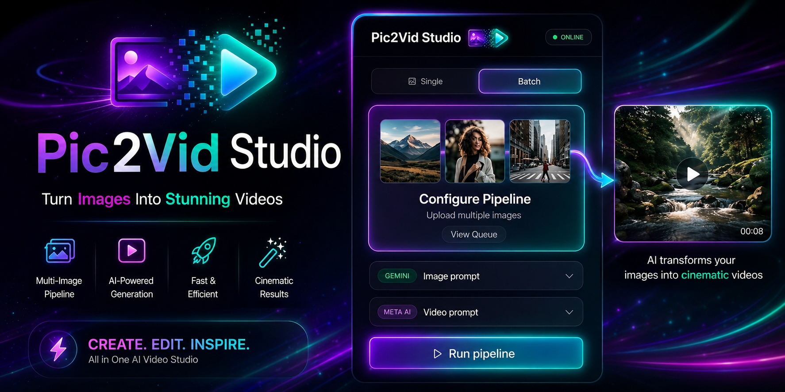

  

<h1 align="center">🎬 Pic2Vid Studio</h1>

  Biến ảnh sản phẩm thành video TikTok tự động — không cần kỹ năng edit, không cần biết AI.

  <a href="https://ngkin01.github.io/Pic2Vid-Studio/">🌐 Xem Demo Giao Diện</a>

---

## ✨ Tính năng

- 📸 **Ảnh → Ảnh đẹp hơn**: Đưa ảnh sản phẩm vào Gemini AI để tự động tạo ra ảnh chất lượng cao hơn
- 🎥 **Ảnh → Video TikTok**: Từ ảnh đó đưa vào Meta AI để tự động tạo video
- 🖥️ Hỗ trợ **Windows** và **macOS**
- ⚡ Giao diện đơn giản, dễ dùng — không cần biết kỹ thuật

---

## 📦 Phiên bản

| Phiên bản | Hệ điều hành |
|-----------|-------------|
| `Pic2Vid Window` | Windows 10 / 11 |
| `Pic2Vid MacOS` | macOS |

---

## 🚀 Cài đặt nhanh (Windows)

### Yêu cầu
- Windows 10 hoặc 11
- Tài khoản **Google** (để dùng Gemini)
- Tài khoản **Facebook** (để dùng Meta AI)
- **Google Chrome** đã cài sẵn

### Các bước

**1.** Tải và cài [Node.js LTS](https://nodejs.org)

**2.** Giải nén folder `Pic2Vid Window` ra Desktop

**3.** Chuột phải vào `SETUP.bat` → **Run as administrator** *(chỉ làm 1 lần)*

**4.** Làm theo hướng dẫn đăng nhập Gemini & Meta AI trên màn hình

**5.** Sau đó mỗi lần dùng chỉ cần double-click `START.bat` là xong!

> 💡 Giữ cửa sổ đen mở trong khi dùng. Đóng cửa sổ đen là ứng dụng tắt.

---

## 🛠️ Công nghệ sử dụng

- **Node.js** — Backend server
- **HTML / CSS / JavaScript** — Giao diện
- **Gemini AI** — Tạo ảnh sản phẩm đẹp hơn
- **Meta AI** — Tạo video từ ảnh

---

## 👤 Tác giả

**Tommy Nguyen** · [@ngkin01](https://github.com/ngkin01)
